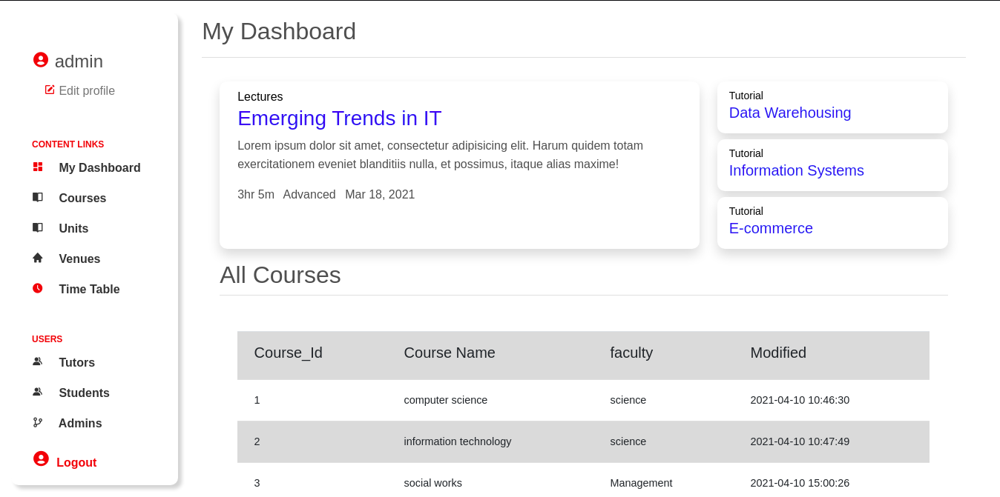
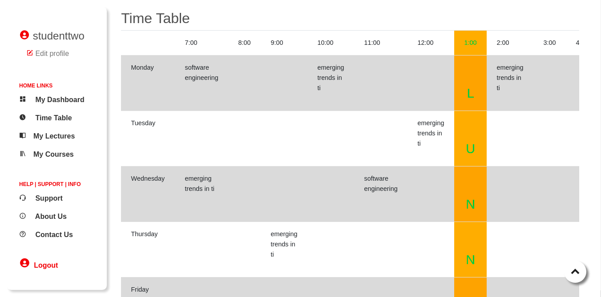
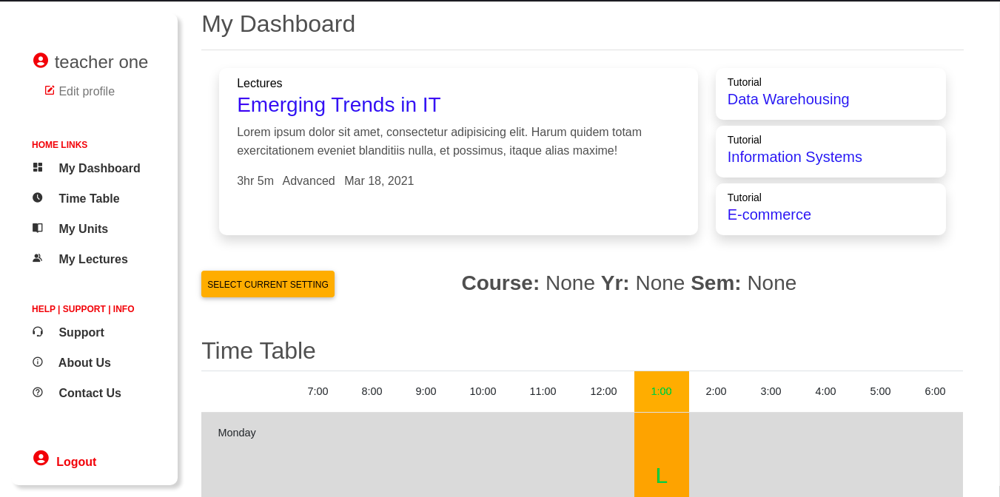
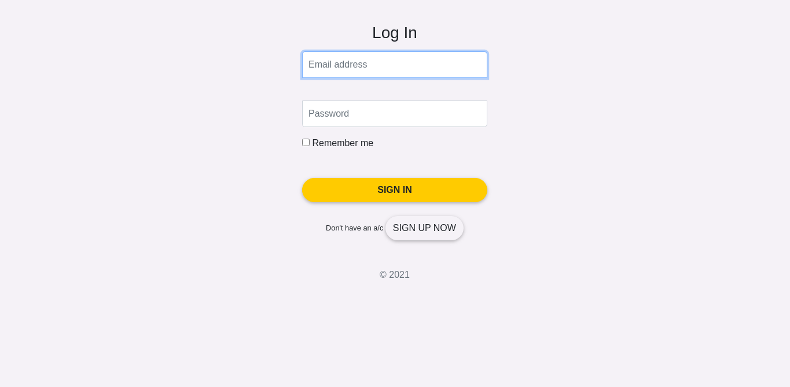
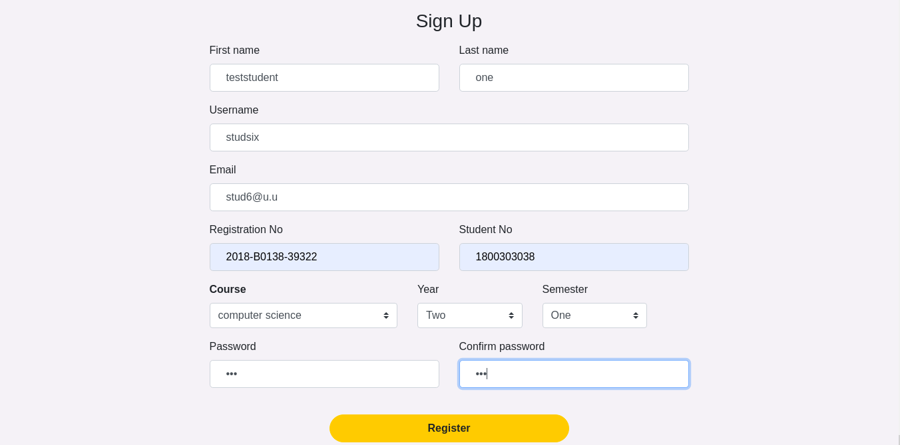
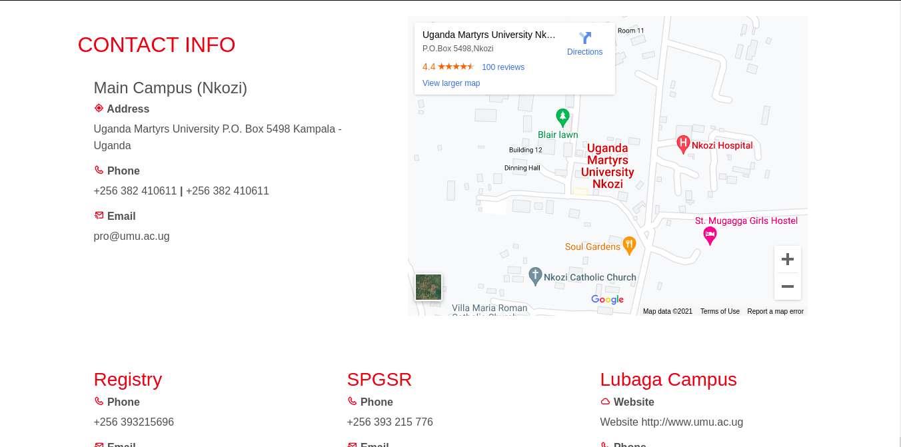
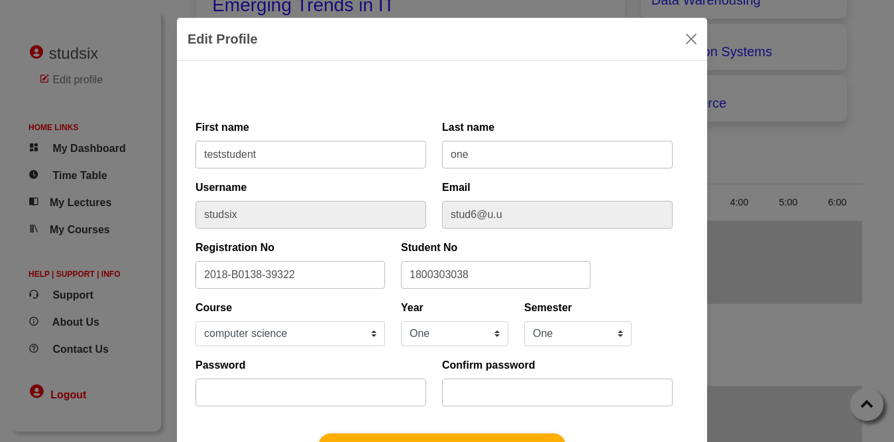
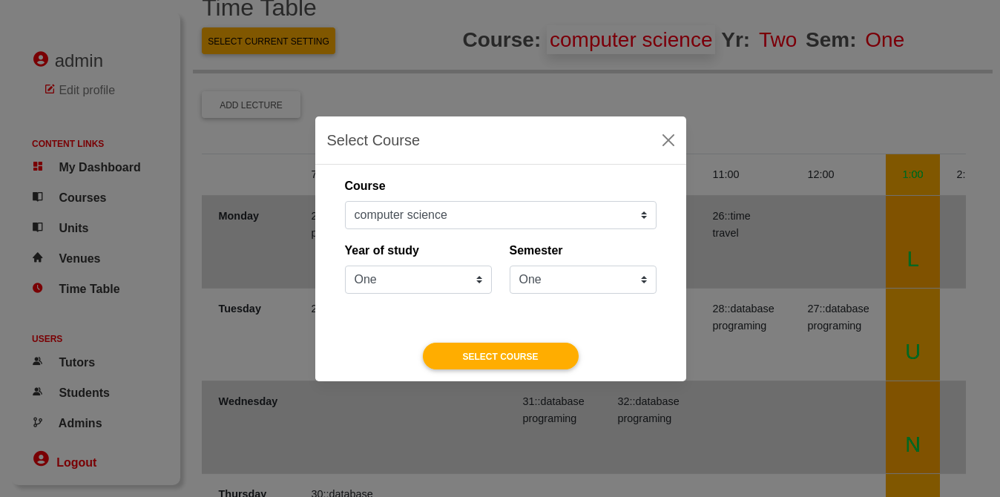
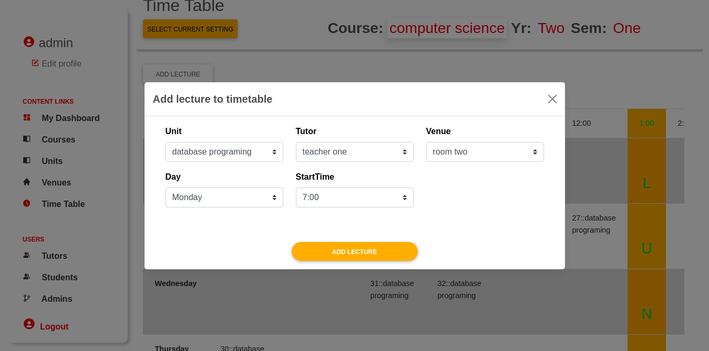
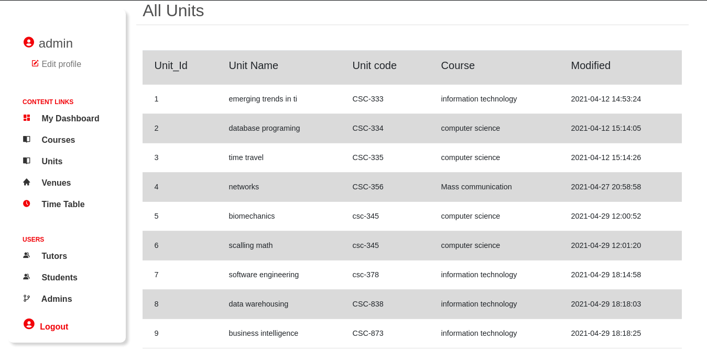

## __Time Table Mangement System__ [Internship Project]

### Designed By
  > [ochen.hillary](https://github.com/occn8)
  
  > [Allen.mabazi](https://github.com/Allenmabazi)
  
  > [Atuhaire.christine](https://github.com/atuhaic)

  > [Baguma.Blair](https://github.com/bagumablair)
  > 
  > [Edeet.Emmanuel.James](https://github.com/Edeet-Emmanuel-James)
  
  > [tobias.ngabirano](https://github.com/tobiasngabirano5)

### Running Project
* [x] __Make sure__ xampp or `any-other` is started or running
* [x] __Move__ the project folder(__intern5__) to location 'PathTo'/lampp/htdocs/
* [x] __Then__ Paste this URL __`http://localhost/intern5/index.php`__ to your browser
* [x] __Done__

## Admin 
> __email__: admin@a.a
> __password__:admin

### Screenshots
__`Admin Home screen`__

__`Student Home screen`__

__`Tutor Home screen`__

__`Sign In screen`__

__`Register screen`__

__`Contact screen`__

__`Edit Profile screen`__

__`Select Course screen`__

__`Add Lecture screen`__

__`Item List screen`__

